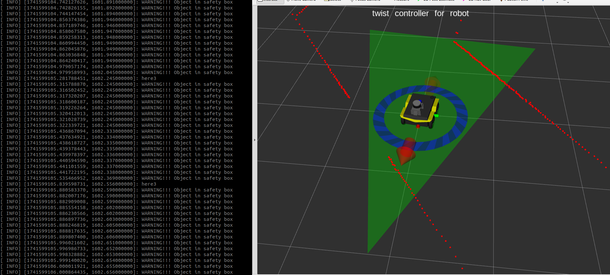
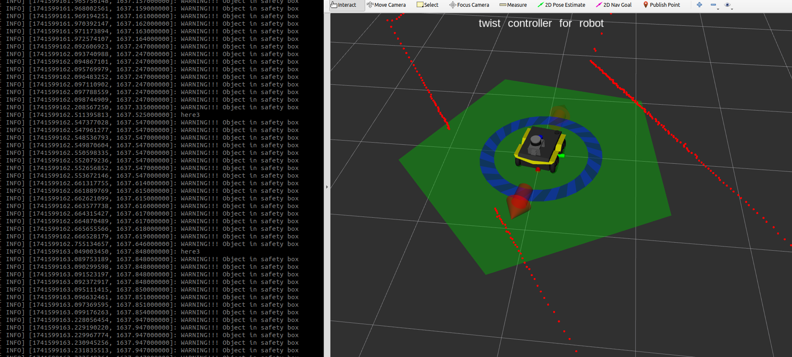
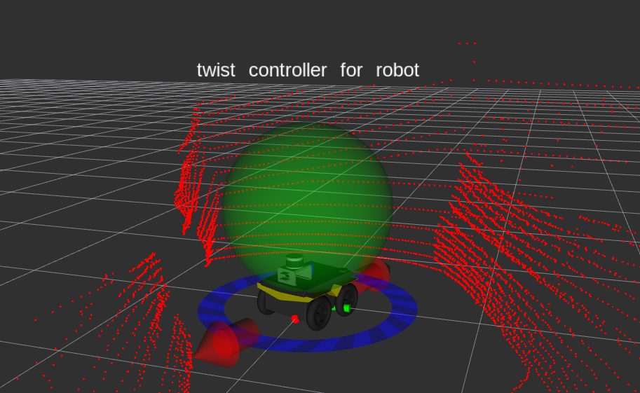
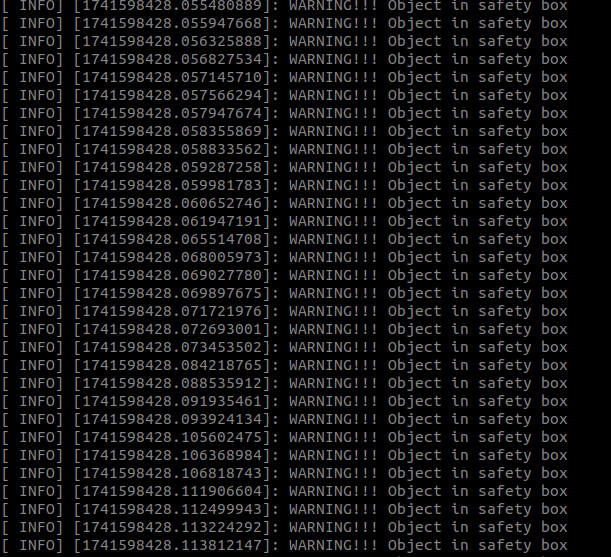

# Safety Boundary Box Package

## Overview

This ROS package **parses LIDAR data (2D LaserScan or 3D PointCloud2)** and checks whether obstacles are inside a user-defined **safety boundary box**.

- Supports **2D** and **3D** LiDARs.
- Accepts data from:
  - `/scan` (LaserScan for 2D)
  - `/velodyne_points` (PointCloud2 for 3D)
- Different **boundary box shapes** are supported for safety detection.
- Optimized using **downsampling** and **filters** for efficient real-time processing.
- Optional **RViz visualization node** provided.

## Features

✅ 2D LaserScan & 3D PointCloud2 compatibility  
✅ Boundary box shapes: Triangle, Circle, Square, Ellipse, Pentagon, Sphere, Cuboid, Ellipsoid  
✅ Highly configurable via ROS params (YAML)  
✅ Downsampling for faster processing  
✅ Passthrough filter to ignore ground/floor in 3D mode  
✅ Multithreaded for efficiency  
✅ Optional RViz visualization node  

## How it Works

1. **Choose LiDAR Type**  
   - `0` = 2D LaserScan  
   - `1` = 3D PointCloud2  
   *(set via `lidar_type` parameter in `params.yaml`)*  

2. **LiDAR data is parsed**:  
   - For **2D**, LaserScan is converted to (x, y) points.  
   - For **3D**, PointCloud2 is converted to (x, y, z) points, floor is filtered out, and points are downsampled.  

3. **Boundary box detection** runs:  
   - The shape and size of the boundary box are configured via `params.yaml`.  
   - If a point is inside the box, a **safety flag** is raised.  

4. **Optional RViz node** can visualize the detection process.

## Getting Started

### Prerequisites

- ROS (tested on ROS Noetic)
- PCL (Point Cloud Library)

### Installation

Clone this package into your ROS workspace `src/` directory and build:

```bash 
cd ~/catkin_ws/src
git clone https://github.com/your_username/safety_boundary_box.git
cd ~/catkin_ws
catkin_make
source devel/setup.bash
```

## Launch File
- The launch file (launch_file.launch) performs the following tasks:
- Loads the parameters from params.yaml
- Starts the laser_parser_node which subscribes to either /scan (for 2D LiDAR) or /velodyne_points (for 3D LiDAR).
- Launch RVIZ visualization node

   ```bash
   roslaunch safety_boundary_box laser_parser.launch
   ```
  
## Node Information

**laser_parser_node**

| **Topic**             | **Type**                       | **Description**                              |
|-----------------------|--------------------------------|----------------------------------------------|
| **/scan**             | sensor_msgs/LaserScan          | 2D Lidar input                              |
| **/velodyne_points**  | sensor_msgs/PointCloud2        | 3D Lidar input (future)                     |
| **/visualization_marker** | visualization_msgs/Marker     | RViz Markers for boundary box               |


### Parameters

| **Parameter**        | **Type**   | **Description**                       | **Example**   |
|----------------------|------------|---------------------------------------|---------------|
| **robot_name**       | string     | Optional robot name                   | "Jackal"      |
| **lidar_type**       | int        | 0 for 2D, 1 for 3D LiDAR              | 0             |
| **min_height**       | double     | Minimum height filter (3D only)       | 0.1           |
| **boundary_box**     | int        | Shape ID (see below)                  | 4             |

## Boundary Box Shape IDs

| **ID** | **Shape**    |
|--------|--------------|
| 0      | Triangle     |
| 1      | Circle       |
| 2      | Square       |
| 3      | Ellipse      |
| 4      | Pentagon     |
| 5      | Sphere       |
| 6      | Cuboid       |
| 7      | Ellipsoid    |
  
## Troubleshooting
- No Data Received: Ensure that the LiDAR is publishing data to the correct topic (/scan for 2D, /velodyne_points for 3D).
- Incorrect Boundary Shape: Double-check the boundary_box parameter and the corresponding shape-specific parameters in params.yaml.
- Slow Processing: If the system is slow, consider increasing the downsampling rate or reducing the complexity of the boundary shape.

## Pictures 📷
You can showcase your system here! Example below:

- **2D Boundary Box Detection (RViz)**
  
  
  

-  **2D Boundary Box Detection (RViz)**
  
  

**Warning Message**
  
  

## Example Applications 🚀
3d_pointcloud_processing
- Autonomous Robot Safety Zones
- Lidar-based Obstacle Avoidance
- Industrial Robot Collision Prevention

## Future Work / TODO

- Add support for multi-lidar fusion
- Support dynamic boundary shapes
- Add diagnostics publishing
- Port to ROS 2


